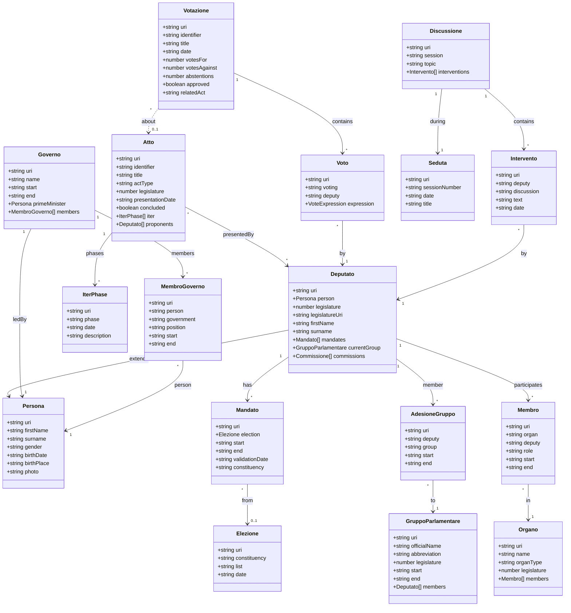

# Documentazione Camera dei Deputati

Documentazione completa per l'integrazione con i dati aperti della Camera dei Deputati italiana.

## 📚 Indice Documentazione

### 1. [Ontologia Camera dei Deputati](./01-ontologia-camera.md)
Documentazione completa dell'ontologia OCD (Ontologia della Camera dei Deputati).

**Contenuto:**
- Classi principali (Deputato, Atto, Votazione, Governo, Organo)
- Proprietà e relazioni
- Struttura gerarchica
- Pattern URI e vocabolari integrati (FOAF, Dublin Core, BIO)
- Processo legislativo ed elettorale

**Fonte:** https://dati.camera.it/ocd-ontologia-della-camera-dei-deputati

### 2. [Rappresentazione Semantica](./02-rappresentazione-semantica.md)
Architettura e specifiche tecniche del sistema linked data.

**Contenuto:**
- Struttura URI delle risorse
- 14 dataset disponibili
- Allineamenti con dataset esterni (DBpedia, Wikidata)
- Metodi di accesso e formati supportati

### 3. [SPARQL Endpoint](./03-sparql-endpoint.md)
Informazioni sull'endpoint SPARQL e configurazione.

**Contenuto:**
- URL endpoint e formati supportati
- Configurazione server Virtuoso
- Query di esempio base

### 4. [Esempi Query SPARQL](./04-query-examples.md)
Raccolta di 16+ query SPARQL pronte all'uso.

**Categorie:**
- Deputati (ricerca, biografia, mandati)
- Atti parlamentari (ricerca, iter, stato)
- Votazioni (recenti, per atto, statistiche)
- Governi (composizione, membri)
- Organi parlamentari (commissioni, ruoli)
- Query complesse (carriere, aggregazioni)

### 5. [Query Ufficiali Camera](./05-query-examples-official.md)
Query SPARQL validate ed utilizzate ufficialmente dalla Camera.

**Contenuto:**
- Deputati in carica con informazioni complete
- Incarichi in organi e gruppi parlamentari
- Atti con iter completo
- Votazioni e espressioni di voto
- Interventi in aula su tematiche specifiche
- Bibliografia del Parlamento (BPR)

---

## 🔗 Quick Links

| Risorsa | URL |
|---------|-----|
| **SPARQL Endpoint** | https://dati.camera.it/sparql |
| **Ontologia Ufficiale** | https://dati.camera.it/ocd-ontologia-della-camera-dei-deputati |
| **Dati Aperti Camera** | https://dati.camera.it |
| **Editor SPARQL Online** | https://dati.camera.it/sparql |
| **Licenza** | Creative Commons Attribution 4.0 |

---

## 🚀 Quick Start

### 1. Test Base

```bash
# Test sistema completo
npm run cli

# Query di test
🏛️  > Chi è Giorgia Meloni?
```

### 2. Query di Base

```sparql
PREFIX ocd: <http://dati.camera.it/ocd/>
PREFIX foaf: <http://xmlns.com/foaf/0.1/>

# Deputati in carica
SELECT DISTINCT ?deputato ?cognome ?nome ?genere
WHERE {
    ?deputato a ocd:deputato ;
        ocd:rif_leg <http://dati.camera.it/ocd/legislatura.rdf/repubblica_19> ;
        ocd:rif_mandatoCamera ?mandato ;
        foaf:surname ?cognome ;
        foaf:firstName ?nome ;
        foaf:gender ?genere .

    MINUS { ?mandato ocd:endDate ?fineMandato }
}
ORDER BY ?cognome ?nome
LIMIT 10
```

### 3. Prefissi Comuni

```sparql
PREFIX ocd: <http://dati.camera.it/ocd/>
PREFIX foaf: <http://xmlns.com/foaf/0.1/>
PREFIX dc: <http://purl.org/dc/elements/1.1/>
PREFIX dcterms: <http://purl.org/dc/terms/>
PREFIX bio: <http://purl.org/vocab/bio/0.1/>
PREFIX rdfs: <http://www.w3.org/2000/01/rdf-schema#>
PREFIX xsd: <http://www.w3.org/2001/XMLSchema#>
PREFIX skos: <http://www.w3.org/2004/02/skos/core#>
```

---

## ⚠️ Caratteristiche Specifiche Camera

### 1. Cognome
```sparql
# Camera usa foaf:surname (non lastName come il Senato)
?deputato foaf:surname ?cognome .
```

### 2. Legislatura
```sparql
# Camera - URI completo
?mandato ocd:rif_leg <http://dati.camera.it/ocd/legislatura.rdf/repubblica_19> .

# Formato breve non supportato
# ?mandato ocd:rif_leg 19 .  # ← NON funziona!
```

### 3. Date
```sparql
# Camera usa startDate/endDate
?mandato ocd:startDate ?inizio ;
    ocd:endDate ?fine .

# Formato: YYYYMMDD (es: "20221013" = 13 ottobre 2022)
```

### 4. Mandati Attivi
```sparql
# Per ottenere solo deputati in carica
?deputato ocd:rif_mandatoCamera ?mandato .
MINUS { ?mandato ocd:endDate ?fineMandato }
```

---

## 📊 Struttura Dati Principale

### Deputato
```typescript
interface Deputato {
  uri: string;
  firstName: string;
  surname: string;  // NON lastName!
  gender: 'male' | 'female';
  photo?: string;
  birthDate?: string;
  birthPlace?: string;
  mandates: Mandate[];
  commissions?: CommissionMembership[];
  groups?: GroupMembership[];
}
```

### Mandato
```typescript
interface Mandate {
  legislature: string;  // URI completo, NON intero!
  startDate: string;    // YYYYMMDD
  endDate?: string;     // YYYYMMDD
  validation?: string;  // Data convalida
  constituency?: string;  // Collegio elettorale
  list?: string;        // Lista elettorale
}
```

### Atto Parlamentare
```typescript
interface Atto {
  uri: string;
  title: string;
  type: string;        // PDL, Mozione, Interrogazione, etc.
  date: string;
  legislature: string;
  statoIter?: string;  // Stato procedura
  concluso?: boolean;  // Se concluso
  presenters?: Deputy[];  // Presentatori
}
```

### Votazione
```typescript
interface Votazione {
  uri: string;
  description: string;
  date: string;        // YYYYMMDD
  favorevoli: number;
  contrari: number;
  astenuti: number;
  presenti: number;
  seduta: string;      // Riferimento seduta
}
```

---

## 🔍 Esempi Pratici

### Cerca Deputato
```sparql
PREFIX ocd: <http://dati.camera.it/ocd/>
PREFIX foaf: <http://xmlns.com/foaf/0.1/>

SELECT ?deputato ?cognome ?nome ?genere
WHERE {
    ?deputato a ocd:deputato ;
        ocd:rif_leg <http://dati.camera.it/ocd/legislatura.rdf/repubblica_19> ;
        foaf:surname ?cognome ;
        foaf:firstName ?nome ;
        foaf:gender ?genere .

    FILTER(REGEX(?cognome, "MELONI", "i"))
}
```

### Atti Presentati da Deputato
```sparql
PREFIX ocd: <http://dati.camera.it/ocd/>
PREFIX foaf: <http://xmlns.com/foaf/0.1/>
PREFIX dc: <http://purl.org/dc/elements/1.1/>

SELECT ?atto ?titolo ?tipo ?data ?ruolo
WHERE {
    # Trova il deputato
    ?deputato a ocd:deputato ;
        foaf:surname "MELONI" ;
        foaf:firstName "GIORGIA" .

    # Atti come primo firmatario o cofirmatario
    {
        ?atto ocd:primoFirmatario ?deputato .
        BIND("Primo Firmatario" as ?ruolo)
    } UNION {
        ?atto ocd:altroFirmatario ?deputato .
        BIND("Cofirmatario" as ?ruolo)
    }

    ?atto dc:title ?titolo ;
        dc:type ?tipo ;
        dc:date ?data .
}
ORDER BY DESC(?data)
LIMIT 20
```

### Votazioni Recenti
```sparql
PREFIX ocd: <http://dati.camera.it/ocd/>
PREFIX dc: <http://purl.org/dc/elements/1.1/>

SELECT ?votazione ?descrizione ?data ?favorevoli ?contrari ?astenuti ?esito
WHERE {
    ?votazione a ocd:votazione ;
        dc:description ?descrizione ;
        dc:date ?data ;
        ocd:favorevoli ?favorevoli ;
        ocd:contrari ?contrari ;
        ocd:astenuti ?astenuti ;
        ocd:esito ?esito .

    FILTER(xsd:integer(?data) >= 20240101)
}
ORDER BY DESC(?data)
LIMIT 20
```

---

## 🛠️ Pattern Comuni

### Filtrare Deputati Attivi
```sparql
?deputato ocd:rif_mandatoCamera ?mandato .
MINUS { ?mandato ocd:endDate ?fineMandato }
```

### Filtrare per Legislatura
```sparql
# XIX Legislatura (corrente, 2022-oggi)
?deputato ocd:rif_leg <http://dati.camera.it/ocd/legislatura.rdf/repubblica_19> .

# XVIII Legislatura (2018-2022)
?deputato ocd:rif_leg <http://dati.camera.it/ocd/legislatura.rdf/repubblica_18> .
```

### Filtrare per Data
```sparql
# Date in formato YYYYMMDD (intero)
FILTER(xsd:integer(?data) >= 20230101)
FILTER(xsd:integer(?data) <= 20231231)
```

### Ricerca Case-Insensitive
```sparql
FILTER(REGEX(?cognome, "meloni", "i"))  # 'i' flag = case-insensitive
```

### Gruppo Parlamentare Attivo
```sparql
?deputato ocd:aderisce ?aderisce .
?aderisce ocd:rif_gruppoParlamentare ?gruppo .
MINUS { ?aderisce ocd:endDate ?fineAdesione }
```

---

## 📈 Legislature Disponibili

| Legislatura | Numero | Periodo | Status | URI |
|-------------|--------|---------|--------|-----|
| **XIX** | 19 | 2022-presente | ✅ Corrente | `repubblica_19` |
| **XVIII** | 18 | 2018-2022 | Completa | `repubblica_18` |
| **XVII** | 17 | 2013-2018 | Completa | `repubblica_17` |
| **XVI** | 16 | 2008-2013 | Completa | `repubblica_16` |
| Precedenti | 1-15 | 1948-2008 | Disponibili | `repubblica_*` |

---

## 🎯 Classi Principali

### Persone e Mandati
- `ocd:deputato` - Deputati
- `ocd:persona` - Persone generiche
- `ocd:mandatoCamera` - Mandati parlamentari
- `ocd:membroGoverno` - Membri governo

### Atti Legislativi
- `ocd:atto` - Atti generici (PDL, mozioni, etc.)
- `ocd:legge` - Leggi approvate
- `ocd:DOC` - Documenti non legislativi
- `ocd:dossier` - Dossier di approfondimento
- `ocd:aic` - Atti di controllo e sindacato ispettivo

### Processo Legislativo
- `ocd:abbinamento` - Abbinamento atti
- `ocd:assegnazione` - Assegnazione commissioni
- `ocd:trasmissione` - Trasmissione al Senato
- `ocd:statoIter` - Stato procedura
- `ocd:richiestaParere` - Richiesta pareri

### Attività Parlamentare
- `ocd:seduta` - Sedute assemblea
- `ocd:discussione` - Discussioni
- `ocd:votazione` - Votazioni
- `ocd:intervento` - Interventi in aula
- `ocd:dibattito` - Dibattiti

### Organi e Gruppi
- `ocd:organo` - Organi parlamentari (commissioni)
- `ocd:gruppoParlamentare` - Gruppi parlamentari
- `ocd:governo` - Governi
- `ocd:assemblea` - Assemblea

---

## 🏗️ Workflow Implementazione RepublicMCP

### Architettura Codice

```
src/institutions/camera/
├── ontology/
│   ├── prefixes.ts      # Prefissi e URI builder
│   └── types.ts         # TypeScript types
├── queries/
│   ├── deputati.ts      # Query deputati
│   ├── atti.ts          # Query atti
│   ├── votazioni.ts     # Query votazioni
│   ├── organi.ts        # Query organi/commissioni
│   └── index.ts         # Export centrale
├── tools/
│   └── index.ts         # MCP tools definitions
├── client.ts            # SPARQL client Camera
└── index.ts             # Export modulo
```

### Esempio: Query Deputato

**1. TypeScript Types** (`ontology/types.ts`)
```typescript
export interface DeputatoSearchParams {
  firstName?: string;
  surname?: string;
  legislature?: number;
  parliamentaryGroup?: string;
  limit?: number;
}
```

**2. Query Builder** (`queries/deputati.ts`)
```typescript
export class CameraDeputatiQueries {
  static searchDeputies(params: DeputatoSearchParams): string {
    const legislatureUri = buildLegislatureUri(params.legislature || 19);

    return `
      SELECT DISTINCT ?deputato ?cognome ?nome ?genere
      WHERE {
        ?deputato a ocd:deputato ;
          ocd:rif_leg <${legislatureUri}> ;
          foaf:surname ?cognome ;
          foaf:firstName ?nome ;
          foaf:gender ?genere .

        ${params.surname ? `FILTER(REGEX(?cognome, "${params.surname}", "i"))` : ''}
      }
      ORDER BY ?cognome ?nome
      LIMIT ${params.limit || 100}
    `;
  }
}
```

**3. MCP Tool** (`tools/index.ts`)
```typescript
{
  name: 'search_deputati',
  description: 'Cerca deputati della Camera per nome, cognome o gruppo',
  inputSchema: {
    type: 'object',
    properties: {
      cognome: { type: 'string', description: 'Cognome deputato' },
      nome: { type: 'string', description: 'Nome deputato' },
      legislatura: { type: 'number', description: 'Numero legislatura (default: 19)' }
    }
  }
}
```

**4. Utilizzo CLI**
```bash
🏛️  > Cerca deputati con cognome Meloni
→ AI traduce in: search_deputati({ cognome: "Meloni" })
→ Query SPARQL eseguita
→ Risultato: MELONI GIORGIA (female)
```

---

## 🧪 Testing

### Test Query Online
1. Vai a https://dati.camera.it/sparql
2. Copia query da `04-query-examples.md`
3. Esegui e verifica risultati

### Test con RepublicMCP
```bash
# Build e avvia CLI
npm run build
npm run cli

# Test query base
🏛️  > Chi è Giorgia Meloni?
🏛️  > Ultime 10 votazioni
🏛️  > Quali sono i gruppi parlamentari?

# Test query avanzate
🏛️  > Quali atti ha presentato Meloni?
🏛️  > Statistiche voti Meloni
🏛️  > Interventi sull'immigrazione
```

---

## 📚 Riferimenti

### Documentazione Ufficiale
- **Ontologia OCD**: https://dati.camera.it/ocd-ontologia-della-camera-dei-deputati
- **Rappresentazione Semantica**: https://dati.camera.it/ocd-rappresentazione-semantica-e-documentazione
- **SPARQL Endpoint**: https://dati.camera.it/sparql
- **Dati Aperti**: https://dati.camera.it

### Ontologie Standard
- **FOAF**: http://xmlns.com/foaf/spec/
- **Dublin Core**: http://purl.org/dc/elements/1.1/
- **BIO**: http://purl.org/vocab/bio/0.1
- **SKOS**: http://www.w3.org/2004/02/skos/core

### Senato della Repubblica (confronto)
- **Ontologia OSR**: https://dati.senato.it/DatiSenato/browse/21
- **SPARQL Endpoint**: https://dati.senato.it/sparql
- **Differenze**: Vedi `../senato/03-differenze-camera-senato.md`

---

## 💡 Tips & Best Practices

### 1. Usa Sempre foaf:surname
```sparql
# ✅ Corretto per Camera
?deputato foaf:surname ?cognome .

# ❌ Sbagliato (è Senato)
?deputato foaf:lastName ?cognome .
```

### 2. Legislature come URI Completi
```sparql
# ✅ Corretto
?deputato ocd:rif_leg <http://dati.camera.it/ocd/legislatura.rdf/repubblica_19> .

# ❌ Sbagliato
?deputato ocd:rif_leg 19 .
```

### 3. Filtra Mandati Attivi
```sparql
# ✅ Solo deputati in carica
?deputato ocd:rif_mandatoCamera ?mandato .
MINUS { ?mandato ocd:endDate ?fineMandato }
```

### 4. Date come Interi
```sparql
# ✅ Date in formato YYYYMMDD
FILTER(xsd:integer(?data) >= 20240101)

# ⚠️ Non usare confronti stringa
FILTER(?data >= "2024-01-01")  # Potrebbe non funzionare
```

### 5. Limita Risultati
```sparql
# ✅ Sempre nelle query esplorative
LIMIT 100

# ✅ Ordina prima di limitare
ORDER BY DESC(?data)
LIMIT 50
```

---

## 🐛 Troubleshooting

### Query Non Restituisce Risultati

**Check 1**: Stai usando `foaf:surname` e non `foaf:lastName`?
```sparql
# ✅ Camera
foaf:surname

# ❌ Senato
foaf:lastName
```

**Check 2**: Legislature è URI completo e non numero?
```sparql
# ✅ Camera
ocd:rif_leg <http://dati.camera.it/ocd/legislatura.rdf/repubblica_19>

# ❌ Formato sbagliato
ocd:rif_leg 19
```

**Check 3**: Il deputato esiste alla Camera?
- Verifica su https://www.camera.it/leg19/1
- Alcuni politici sono senatori (es: Salvini, La Russa)

### Timeout Query

**Soluzione 1**: Aggiungi LIMIT
```sparql
LIMIT 100  # Inizia con piccoli set
```

**Soluzione 2**: Filtra per legislatura
```sparql
?deputato ocd:rif_leg <http://dati.camera.it/ocd/legislatura.rdf/repubblica_19> .
```

**Soluzione 3**: Usa range date
```sparql
FILTER(xsd:integer(?data) >= 20230101)
FILTER(xsd:integer(?data) <= 20231231)
```

---

## 🖼️ Diagramma Ontologia TypeScript

### 📊 Struttura Dati e Relazioni

Il seguente diagramma mostra la struttura completa dei types TypeScript basati sull'ontologia OCD della Camera:



### 🎯 Caratteristiche Chiave dell'Ontologia Camera

**⚠️ Differenze Critiche con Senato:**

| Caratteristica | Camera (OCD) | Senato (OSR) |
|----------------|--------------|--------------|
| **Cognome** | `foaf:surname` | `foaf:lastName` |
| **Legislatura** | URI completo `<http://...repubblica_19>` | Numero intero `19` |
| **Date** | `ocd:startDate`/`ocd:endDate` | `osr:inizio`/`osr:fine` |
| **Formato Date** | YYYYMMDD (integer: `20231013`) | ISO string (`"2023-10-13"`) |
| **Mandati Attivi** | `MINUS { ?mandato ocd:endDate ?fine }` | `FILTER(!bound(?fine))` |

### 📊 Gerarchia Entità

```
Legislatura (URI completo)
│
├── Deputato → Persona
│   ├── Mandato → Elezione
│   ├── AdesioneGruppo → GruppoParlamentare
│   └── Membro → Organo/Commissione
│
├── Atto Parlamentare
│   ├── IterPhase (fasi)
│   └── Deputati (proponents)
│
├── Votazione
│   └── Voto → Deputato
│
├── Governo
│   └── MembroGoverno → Persona
│
└── Seduta
    └── Discussione
        └── Intervento → Deputato
```

---

## 📞 Support

Per problemi con:
- **Endpoint/Dati**: Contatta dati@camera.it
- **RepublicMCP**: Apri issue su GitHub
- **Documentazione**: PR benvenute!

---

## 📄 Licenza

- **Dati Camera**: Creative Commons Attribution 4.0
- **Questa Documentazione**: Parte di RepublicMCP

---

**Ultimo aggiornamento**: 2025-11-12
**Versione Documentazione**: 2.0.0
